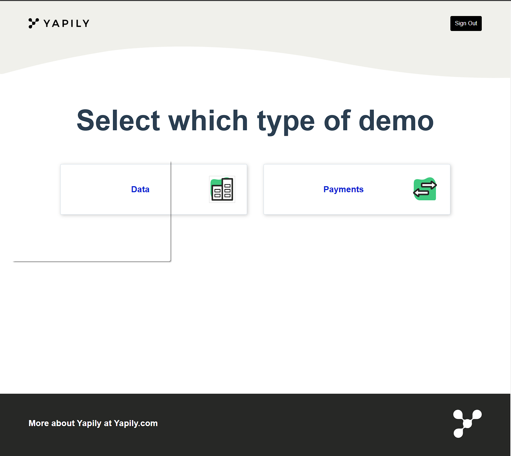
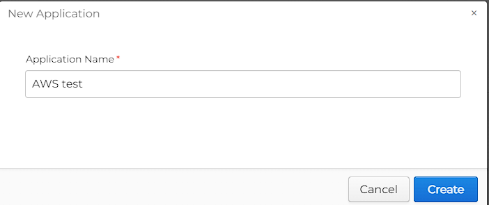
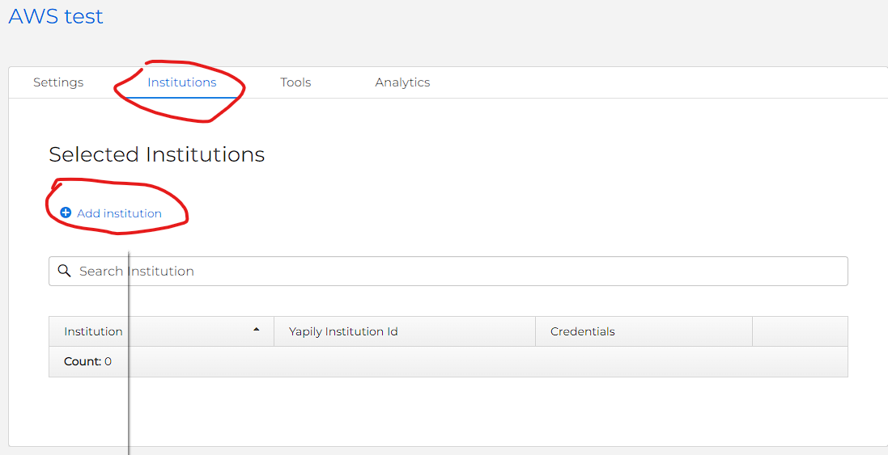
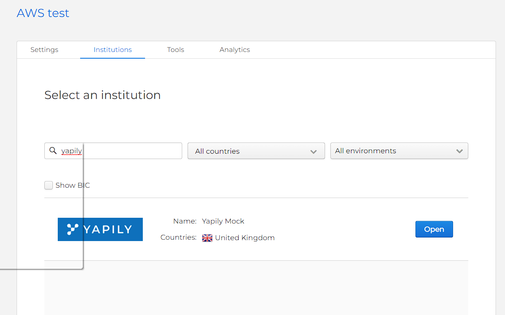
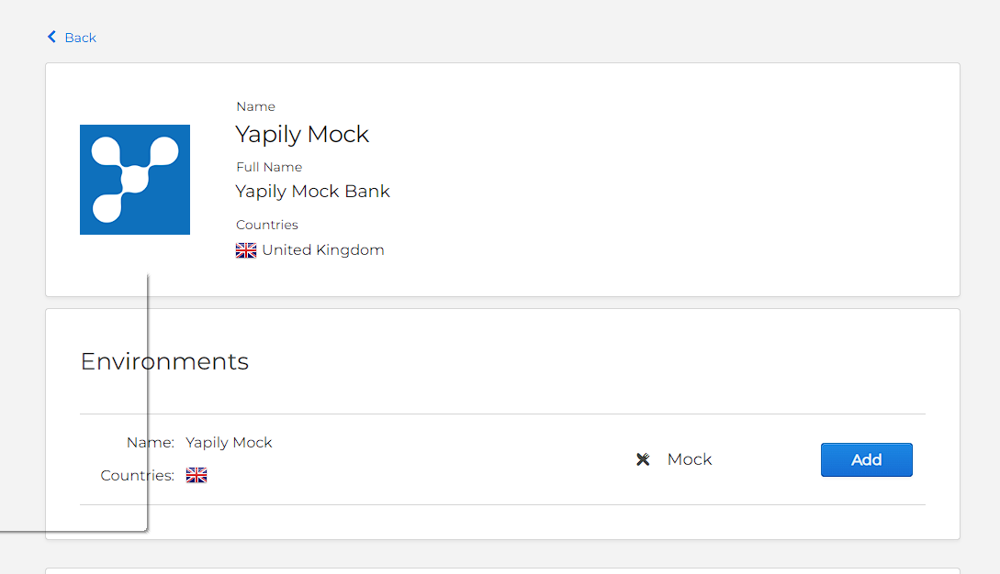
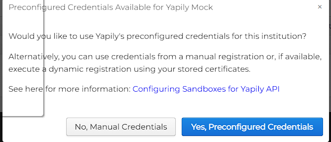
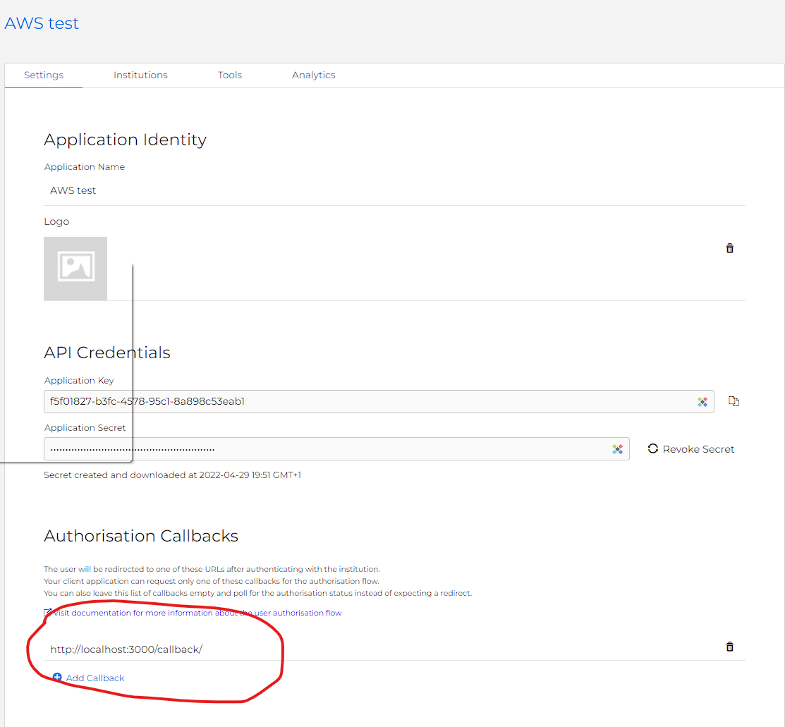

# AWS Yapily Demo App
This repo demonstrates how to build a Fintech app on AWS that uses yapily Link to connect a user to his or her bank
account. The app allows users to sign up using Amazon Cognito, select their bank from a list, log in to the bank, and display the latest transactions. The app is built using AWS Amplify, Amazon API Gateway, Amazon Cognitio, AWS Secrets
Manager and Amazon DynamoDB.



## Pre-requisites
Before building the app, you will need to get your API keys from Yapily. Go to https://dashboard.yapily.com.

Once logged into the dashboard 

### Create new Application



Once the application is created it will give you the Application key and Secret to download


save these credentials

### Add institutions to the application





add Yapily mock institution



Select the mock environment and click add 




Choose the Preconfigured Credentials

Your application should now have an institution which we can test the API with

### Add Callback URL



In this example we will add http://localhost:3000/callback to our Authorisation Callbacks in the application


### Install AWS Amplify

Install AWS Amplify by following the instructions at https://docs.amplify.aws/cli/start/install/

If you have not already done so, create a default AWS configuration profile by running the **aws configure** command, as described at https://docs.aws.amazon.com/cli/latest/userguide/cli-configure-quickstart.html#cli-configure-quickstart-config

## 1. Initialize a new amplify project.

### `amplify init`

```
? Enter a name for the project (awsyapilydemoapp)
? Initialize the project with the above configuration? (Y/n) y
? Select the authentication profile you want to use: AWS profile 
? Please choose the profile you want to use: default
```
## 2. Add Authentication.

### `amplify add auth`
```
? Do you want to use the default authentication configuration? Default configuration 
? How do you want users to be able to sign in? (Use arrow keys and space bar to select)
•	Email
•	Username
? Do you want to configure advanced settings? No, I am done
```

## 3. Add the API.

### `amplify add api`

Follow these steps after for API creation

```
? Please select from one of the below mentioned services: REST
? Would you like to add a new path to an existing REST API: No
? Provide a friendly name for your resource to be used as a label for this category in the project: yapilytestapi
? Provide a path (e.g., /book/{isbn}): /v1
? Choose a Lambda source Create a new Lambda function
? Provide an AWS Lambda function name: yapilyaws
? Choose the runtime that you want to use: NodeJS
? Choose the function template that you want to use: Serverless ExpressJS function (Integration with API Gateway)

Available advanced settings:
- Resource access permissions
- Scheduled recurring invocation
- Lambda layers configuration
- Environment variables configuration
- Secret values configuration

? Do you want to configure advanced settings? Yes
? Do you want to access other resources in this project from your Lambda function? No
? Do you want to invoke this function on a recurring schedule? No
? Do you want to enable Lambda layers for this function? No
? Do you want to configure environment variables for this function? Yes
? Enter the environment variable name: APPLICATION_ID
? Enter the environment variable value: [Enter your yapily application Key - when applicaiton was created]
? Select what you want to do with environment variables: Add new environment variable
? Enter the environment variable name: APPLICATION_SECRET
? Enter the environment variable value: [Enter your yapily application secret key - when applicaiton was created]
? Select what you want to do with environment variables: Add new environment variable
? Enter the environment variable name: APPLICATION_USER
? Enter the environment variable value: [can be a random string]
? Select what you want to do with environment variables: Add new environment variable
? Enter the environment variable name: TABLE_NAME
? Enter the environment variable value: yapilyawsdb
? Select what you want to do with environment variables: I'm done


You can access the following resource attributes as environment variables from your Lambda function
	ENV
	REGION
	CLIENT_ID
	TABLE_NAME

? Do you want to configure secret values this function can access? Yes
? Enter a secret name (this is the key used to look up the secret value): yapily_SECRET
? Enter the value for yapily_SECRET: [Enter your yapily sandbox API key - hidden]
? What do you want to do? I'm done
? Do you want to edit the local lambda function now? No
? Press enter to continue
Successfully added resource yapilyaws locally.
? Restrict API access No
? Do you want to add another path? No
Successfully added resource yapilytestapi locally
```

Copy the lambda function file

`cp functions/app.js amplify/backend/function/yapilyaws/src/app.js`

Next `cd` into our lambda function's directory

`cd amplify/backend/function/yapilyaws/src`

install some dependencies we're going to be using

`npm i aws-sdk`


## 4. Push to amplify

`amplify push`

## 5. Add Storage.

### `amplify add storage`

```
? Please select from one of the below mentioned services: NoSQL Database

Welcome to the NoSQL DynamoDB database wizard
This wizard asks you a series of questions to help determine how to set up your NoSQL database table.

? Please provide a friendly name for your resource that will be used to label this category in the project: yapilyawsdb

The table name must be the same as the value of the TABLE_NAME environment variable above 

? Please provide table name: yapilyawsdb

You can now add columns to the table.

? What would you like to name this column: id
? Please choose the data type: string
? Would you like to add another column? Yes
? What would you like to name this column: token
? Please choose the data type: string
? Would you like to add another column? No

Before you create the database, you must specify how items in your table are uniquely organized. You do this by specifying a primary key. The primary key uniquely identifies each item in the table so that no two items can have the same key. This can be an individual column, or a combination that includes a primary key and a sort key.

To learn more about primary keys, see:
https://docs.aws.amazon.com/amazondynamodb/latest/developerguide/HowItWorks.CoreComponents.html#HowItWorks.CoreComponents.PrimaryKey

? Please choose partition key for the table: id
? Do you want to add a sort key to your table? No

You can optionally add global secondary indexes for this table. These are useful when you run queries defined in a different column than the primary key.
To learn more about indexes, see:
https://docs.aws.amazon.com/amazondynamodb/latest/developerguide/HowItWorks.CoreComponents.html#HowItWorks.CoreComponents.SecondaryIndexes

? Do you want to add global secondary indexes to your table? No
? Do you want to add a Lambda Trigger for your Table? No
Successfully added resource yapilyawsdb locally
```

## 6. Update our Lambda function to add permissions for database.

### `amplify update function`

```
? Select the Lambda function you want to update yapilyaws
General information
- Name: yapilyaws
- Runtime: nodejs

Resource access permission
- Not configured

Scheduled recurring invocation
- Not configured

Lambda layers
- Not configured

Environment variables:
- CLIENT_ID: yapilyclientid

Secrets configuration
- yapily_SECRET

? Which setting do you want to update? Resource access permissions
? Select the categories you want this function to have access to. storage
? Storage has 2 resources in this project. Select the one you would like your La
mbda to access yapilytestdb
? Select the operations you want to permit on yapilytestdb create, read, update,
delete

You can access the following resource attributes as environment variables from your Lambda function
	STORAGE_yapilyTESTDB_ARN
	STORAGE_yapilyTESTDB_NAME
	STORAGE_yapilyTESTDB_STREAMARN
? Do you want to edit the local lambda function now? No
```

## 7. Add Hosting to deploy the site.

### `amplify add hosting`

? Select the plugin module to execute: Hosting with Amplify Console (Managed hosting)
? Choose a type: Manual deployment


## 8. Publish the site.

### `amplify publish`

## Testing the app

 ### Install depencies

`npm install`

 ### Run dev 

`npm run serve`

open localhost:3000
  
